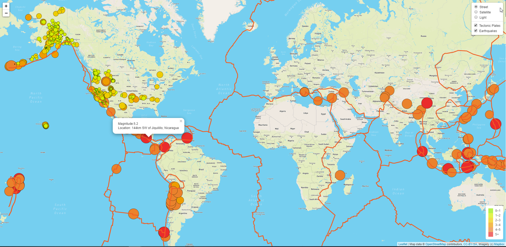
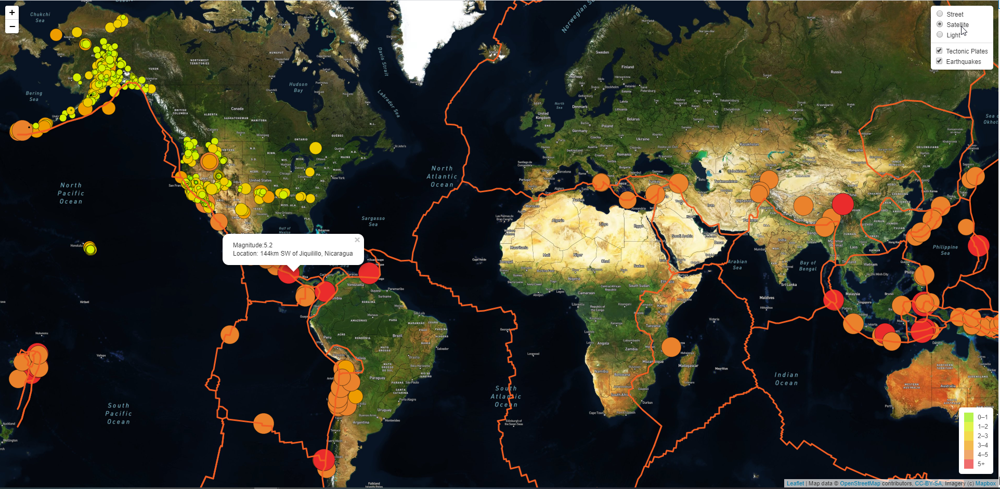
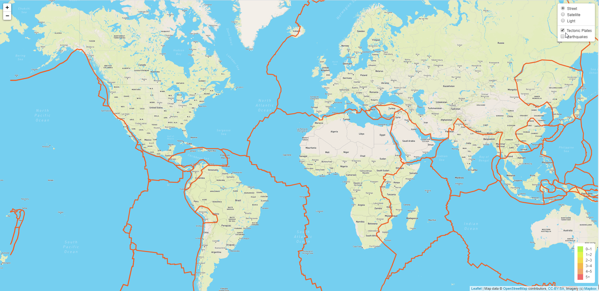

# Mapping last 7 days Earthquakes and Tectonic plates
---

**Summary**
---

Create the earthquake map with different based maps and the earthquakes in 7 days around the world and tectonic plates so we can see the earthquake data in relation to the tectonic plates’ location on the Earth.

**Goals**
---

1. Access different datasets that are opened on internet (WebAPI)
2. Create different based map layers
3. Create different overlay layers for different dataset
4. Create legends

**Resources**
1. Tectonic Plate GeoJSON URL
    - https://raw.githubusercontent.com/fraxen/tectonicplates/master/GeoJSON/PB2002_boundaries.json

2. Earthquake GeoJSON URL
    - https://earthquake.usgs.gov/earthquakes/feed/v1.0/summary/all_week.geojson

3. Map (I used Mapbox. You can use Google Map)
    - https://www.mapbox.com/
    - Register and get the free API_KEY (No Creditcard. Google Map needs to enter credit card)

**Languages**
---

1. Javascript ES6 standard
2. Leaflet.js (open source)
3. D3.js
5. CSS3 
6. HTML5

**Software**
---

1. Visual Studion Code
2. Node.js or Python (run local web application)
    - python -m http.server (run local server)
    - refer: https://nodejs.org/en/docs/guides/getting-started-guide/

**Files**
--
1. [logic.js](Earthquake_Challenge/static/js/logic.js) <-- the map controller
2. [index.html](Earthquake_Challenge/index.html) <-- Map viewer
3. [style.css](Earthquake_Challenge/static/css/style.css) <-- format styles

**Screenshots**
---

**Street base map**

**Satellite base map**

**Light base map**

**Earthquakes overlay**

**Tectonic overlay**

